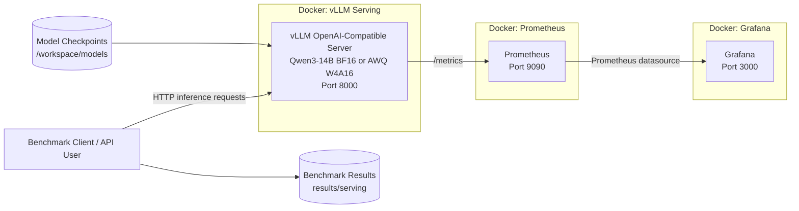

# Qwen3-14B: From Model to Production with vLLM

A reproducible production-oriented LLM serving project built around **Qwen3-14B**, **vLLM**, **AWQ W4A16**, **BF16**, **Prometheus**, and **Grafana**.

The project evaluates the trade-off between model compression, serving performance, latency, SLO compliance, and observability. It was developed for the course **DLBDSMTP01 – Project: From Model to Production**.

---

## Project Overview

The project follows a model-to-production workflow:

1. Start from a **Qwen3-14B BF16 baseline**.
2. Evaluate compression strategies, including **INT8 W8A8** and **AWQ W4A16**.
3. Select a compressed model based on a quality-recovery threshold.
4. Serve BF16 and AWQ with the same **vLLM** configuration.
5. Benchmark both variants under increasing concurrency.
6. Evaluate throughput, TTFT, TPOT, end-to-end latency, goodput, and SLO compliance.
7. Monitor the live serving system using **Prometheus + Grafana**.
8. Expose the model through vLLM's **OpenAI-compatible API**.

The serving experiments use the same model family, tokenizer snapshot, workload, serving seed, maximum context length, and benchmark protocol for BF16 and AWQ.

---

## Key Technologies

- **Model:** Qwen/Qwen3-14B
- **Serving:** vLLM 0.26.0
- **Baseline:** BF16
- **Compression:** AWQ W4A16
- **Additional evaluated compression:** INT8 W8A8
- **GPU:** NVIDIA A100 SXM4 80GB
- **API:** OpenAI-compatible REST API
- **Benchmark client:** Python + httpx
- **Monitoring:** Prometheus
- **Visualization:** Grafana
- **Containerization:** Docker / Docker Compose
- **Environment management:** uv
- **Testing:** pytest

---

## Architecture



The monitoring path is intentionally simple:

```text
vLLM /metrics
      ↓
Prometheus
      ↓
Grafana
```

No custom metrics exporter is required.

---

## Compression Decision

The quality phase compared the original BF16 model with compressed variants.

The project uses a **97% minimum quality-recovery threshold** for selecting a model for serving experiments.

| Variant | Approx. quality recovery | Serving decision |
|---|---:|---|
| BF16 | Baseline | Included |
| AWQ W4A16 | ~97.16% | Included |
| INT8 W8A8 | ~74.87% | Excluded from serving comparison |

AWQ W4A16 met the quality threshold and was therefore selected for the production-serving comparison against BF16.

---

## Serving Benchmark

### Workload

The formal serving workload uses deterministic synthetic interactive-chat prompts.

| Setting | Value |
|---|---|
| Input length | ~1000 tokens |
| Output length | 256 tokens |
| Maximum context length | 8192 |
| Temperature | 0 |
| Seed | 42 |
| Warm-up requests | 5 |
| Measured requests | 100 per concurrency level |
| Tested concurrency | 1, 2, 4, 8, 16, 32 |
| Tensor parallel size | 1 |
| GPU memory utilization | 0.90 |
| Prefix caching | Disabled |

The same saved `workload.json` is reused across model variants to ensure a direct comparison.

---

## SLO Definition

A request is SLO-compliant only if all of the following conditions are met:

| Metric | Threshold |
|---|---:|
| TTFT | ≤ 1000 ms |
| TPOT | ≤ 50 ms/token |
| End-to-end latency | ≤ 15 s |
| Request success rate | ≥ 99% |
| Request-level SLO attainment | ≥ 95% |

An operating point passes only when both the success-rate and SLO-attainment requirements are satisfied.

---

## Measured Serving Results

The following results were measured on a **single NVIDIA A100 SXM4 80GB GPU**.

| Concurrency | AWQ Throughput (req/s) | BF16 Throughput (req/s) | AWQ TTFT p95 | BF16 TTFT p95 | AWQ TPOT p95 | BF16 TPOT p95 | AWQ SLO | BF16 SLO |
|---:|---:|---:|---:|---:|---:|---:|:---:|:---:|
| 1 | **0.465** | 0.200 | 180 ms | **144 ms** | **7.76 ms/token** | 19.11 ms/token | ✅ | ✅ |
| 2 | **0.848** | 0.394 | 328 ms | **260 ms** | **8.57 ms/token** | 19.34 ms/token | ✅ | ✅ |
| 4 | **1.474** | 0.742 | 622 ms | **487 ms** | **9.96 ms/token** | 20.50 ms/token | ✅ | ✅ |
| 8 | **2.268** | 1.286 | 1113 ms | **727 ms** | **12.79 ms/token** | 22.98 ms/token | ❌ | ✅ |
| 16 | **3.009** | 2.034 | 1768 ms | **1388 ms** | **19.09 ms/token** | 27.79 ms/token | ❌ | ❌ |
| 32 | **3.469** | 2.773 | 4335 ms | **3399 ms** | **32.03 ms/token** | 38.43 ms/token | ❌ | ❌ |

### Main observations

- **AWQ provides substantially higher throughput and faster decoding.**
- At concurrency 4, AWQ reaches **1.47 req/s**, compared with **0.74 req/s** for BF16.
- At the same concurrency, AWQ reduces p95 TPOT from **20.50 ms/token to 9.96 ms/token**.
- **BF16 consistently achieves lower TTFT** in the measured workload.
- BF16 remains SLO-compliant through **concurrency 8**, while AWQ remains compliant through **concurrency 4**.
- The result demonstrates that quantization does not improve every latency dimension equally: AWQ strongly benefits decode throughput, while BF16 retains an advantage in prompt-processing latency.

### Maximum SLO-compliant operating points

| Variant | Maximum SLO-compliant concurrency | Goodput at that point |
|---|---:|---:|
| AWQ W4A16 | 4 | 1.474 req/s |
| BF16 | 8 | 1.286 req/s |

---

## Repository Structure

```text
qwen-vllm-production/
├── compose.yaml
├── pyproject.toml
├── uv.lock
├── configs/
│   └── config.yaml
├── docs/
│   ├── phase3_colab_smoke.md
│   ├── phase3_serving.md
│   └── runpod_iac.md
├── infra/
├── observability/
│   ├── grafana/
│   └── prometheus/
├── scripts/
│   ├── benchmark_serving.py
│   ├── benchmark_sweep.py
│   ├── bootstrap_gpu.sh
│   ├── bootstrap_grafana.sh
│   ├── bootstrap_prometheus.sh
│   ├── check_grafana.py
│   ├── check_prometheus.py
│   ├── check_serving.py
│   ├── evaluate_gsm8k.py
│   ├── evaluate_hellaswag.py
│   ├── evaluate_mmlu_pro.py
│   ├── evaluate_perplexity.py
│   ├── evaluate_sanity.py
│   ├── prepare_dashboard.py
│   ├── serve_vllm.py
│   └── summarize_benchmarks.py
├── src/
│   └── qwen_vllm_production/
└── tests/
```

---

## Installation

The project requires **Python 3.11+**.

Using `uv`:

```bash
git clone https://github.com/cao8011158/qwen-vllm-production.git
cd qwen-vllm-production

uv sync --extra benchmark --extra test
```

For a GPU serving environment:

```bash
uv sync --extra serving
```

For the evaluation environment:

```bash
uv sync --extra evaluation
```

---

## Model Layout

The RunPod workflow stores model checkpoints under:

```text
/workspace/models/qwen3-14b/
├── awq_w4a16/
├── bf16/
├── .awq_w4a16.source-revision
└── ...
```

For a formal comparison, the BF16 checkpoint must come from the same immutable source revision used to create the AWQ checkpoint.

The project deliberately does not pass a quantization override to vLLM. vLLM reads the checkpoint's own quantization configuration.

---

## Start the vLLM Server

The serving configuration is equivalent to:

```bash
vllm serve /workspace/models/qwen3-14b/awq_w4a16   --served-model-name qwen3-14b   --max-model-len 8192   --gpu-memory-utilization 0.90   --tensor-parallel-size 1   --host 0.0.0.0   --port 8000   --dtype bfloat16   --seed 42   --no-enable-prefix-caching
```

To serve BF16, use the BF16 checkpoint instead:

```text
/workspace/models/qwen3-14b/bf16
```

The repository also provides:

```bash
python scripts/serve_vllm.py --model-path /path/to/checkpoint
```

and RunPod-oriented bootstrap automation in:

```text
scripts/bootstrap_gpu.sh
```

---

## Check the Server

```bash
python scripts/check_serving.py   --base-url http://127.0.0.1:8000   --model qwen3-14b
```

You can also inspect the OpenAI-compatible model endpoint directly:

```bash
curl http://127.0.0.1:8000/v1/models
```

---

## OpenAI-Compatible API

vLLM exposes an OpenAI-compatible API.

### Chat Completions

```bash
curl http://127.0.0.1:8000/v1/chat/completions   -H "Content-Type: application/json"   -d '{
    "model": "qwen3-14b",
    "messages": [
      {
        "role": "user",
        "content": "Explain continuous batching in vLLM."
      }
    ],
    "temperature": 0.7,
    "max_tokens": 256
  }'
```

When FastAPI documentation is enabled, the interactive Swagger interface is available at:

```text
http://127.0.0.1:8000/docs
```

The formal benchmark itself uses `/v1/completions` because the Qwen chat template is rendered locally before requests are sent.

---

## Run a Serving Benchmark

Example single operating point:

```bash
python scripts/benchmark_serving.py   --base-url http://127.0.0.1:8000   --model qwen3-14b   --variant awq_w4a16   --tokenizer-path /workspace/models/qwen3-14b/awq_w4a16   --checkpoint-path /workspace/models/qwen3-14b/awq_w4a16   --concurrency 4   --num-requests 100   --warmup-requests 5   --input-tokens 1000   --output-tokens 256
```

### Concurrency sweep

```bash
python scripts/benchmark_sweep.py   --base-url http://127.0.0.1:8000   --model qwen3-14b   --variant awq_w4a16   --tokenizer-path /workspace/models/qwen3-14b/awq_w4a16   --checkpoint-path /workspace/models/qwen3-14b/awq_w4a16   --concurrency-levels 1,2,4,8,16,32   --num-requests 100   --warmup-requests 5   --input-tokens 1000   --output-tokens 256   --max-model-len 8192   --gpu-memory-utilization 0.90   --tensor-parallel-size 1   --dtype bfloat16   --serving-seed 42   --seed 42   --output-dir results/serving/runpod   --run-id awq_w4a16_example
```

For a fair BF16 comparison, reuse the saved AWQ workload:

```bash
python scripts/benchmark_sweep.py   --base-url http://127.0.0.1:8000   --model qwen3-14b   --variant bf16   --tokenizer-path /workspace/models/qwen3-14b/awq_w4a16   --checkpoint-path /workspace/models/qwen3-14b/bf16   --workload-file results/serving/runpod/awq_w4a16_example/workload.json   --concurrency-levels 1,2,4,8,16,32   --num-requests 100   --warmup-requests 5   --input-tokens 1000   --output-tokens 256   --max-model-len 8192   --gpu-memory-utilization 0.90   --tensor-parallel-size 1   --dtype bfloat16   --serving-seed 42   --seed 42   --output-dir results/serving/runpod   --run-id bf16_example
```

---

## Benchmark Outputs

Each sweep creates a reproducible result directory:

```text
results/serving/<environment>/<run-id>/
├── workload.json
├── c1/
│   ├── raw.json
│   └── aggregate.json
├── c2/
│   ├── raw.json
│   └── aggregate.json
├── ...
└── sweep_summary.json
```

`raw.json` contains per-request measurements.

`aggregate.json` contains operating-point statistics such as:

- TTFT p50 / p95
- TPOT p50 / p95
- E2E latency p50 / p95
- throughput
- output-token throughput
- goodput
- request success rate
- SLO attainment
- SLO-compliant operating-point status

`sweep_summary.json` identifies the maximum SLO-compliant concurrency and goodput.

---

## Monitoring with Prometheus and Grafana

The repository includes Prometheus and Grafana configuration for real-time observability.

The dashboard can visualize metrics exported directly by vLLM, including:

- running requests
- waiting requests / queue pressure
- KV-cache utilization
- TTFT
- end-to-end latency
- request time per output token
- inter-token latency
- prompt-token throughput
- generation-token throughput
- completed-request activity
- queue / prefill / decode metrics when exported by the active vLLM version

Before generating the full dashboard, capture the runtime `/metrics` output and run:

```bash
python scripts/prepare_dashboard.py
```

This avoids inventing unsupported metric families.

---

## Docker Compose

The repository includes three services:

```text
vLLM
Prometheus
Grafana
```

Before starting Grafana, set an admin password:

```bash
export GRAFANA_ADMIN_PASSWORD='change-me'
docker compose up -d
```

Local endpoints:

```text
vLLM:       http://127.0.0.1:8000
Prometheus: http://127.0.0.1:9090
Grafana:    http://127.0.0.1:3000
```

The checked-in `compose.yaml` currently points the vLLM service to the AWQ checkpoint path. Change the model path when serving BF16.

---

## Reproducibility Controls

The project records or fixes the following parameters for formal comparisons:

- model family
- immutable model revision
- tokenizer snapshot
- prompt sequence
- workload SHA-256
- input and output token targets
- maximum model length
- vLLM version
- dtype
- serving seed
- benchmark seed
- tensor-parallel size
- GPU-memory utilization
- temperature
- chat-template behavior
- thinking mode
- special-token handling
- prefix-caching policy
- warm-up count
- measured request count
- concurrency level

The benchmark uses monotonic clocks for latency and duration measurements and also records UTC timestamps for alignment with Prometheus/Grafana.

---

## Testing

Run the test suite with:

```bash
pytest
```

or, when using `uv`:

```bash
uv run pytest
```

---

## Limitations

The current serving comparison should be interpreted within its experimental scope:

- one Qwen3-14B model family
- one NVIDIA A100 80GB GPU
- synthetic fixed-length interactive-chat workload
- approximately 1000 input tokens and 256 output tokens
- concurrency tested from 1 to 32 in the reported RunPod experiment
- no request-rate arrival process
- no multi-GPU serving comparison
- no production traffic distribution
- serving benchmarks measure performance, not model quality

The results therefore demonstrate the behavior of BF16 and AWQ under this controlled workload, rather than a universal ranking for every production scenario.

---

## Further Documentation

Detailed implementation notes are available in:

- [`docs/phase3_serving.md`](docs/phase3_serving.md) — serving protocol, benchmark definitions, SLO logic, and monitoring
- [`docs/phase3_colab_smoke.md`](docs/phase3_colab_smoke.md) — Colab smoke-testing workflow
- [`docs/runpod_iac.md`](docs/runpod_iac.md) — RunPod deployment and infrastructure workflow
- [`configs/config.yaml`](configs/config.yaml) — project configuration and SLO thresholds

---

## Summary

This project demonstrates an end-to-end path from model compression to production-oriented LLM serving:

```text
Qwen3-14B
   ↓
BF16 baseline
   ↓
Compression evaluation
   ↓
AWQ W4A16 selected
   ↓
vLLM serving
   ↓
Concurrency benchmarking
   ↓
SLO evaluation
   ↓
Prometheus monitoring
   ↓
Grafana visualization
   ↓
OpenAI-compatible API
```

The main serving result is a clear trade-off:

> **AWQ W4A16 provides higher throughput and substantially faster decoding, while BF16 provides lower TTFT and remains SLO-compliant at a higher concurrency under the project's 1-second TTFT threshold.**
